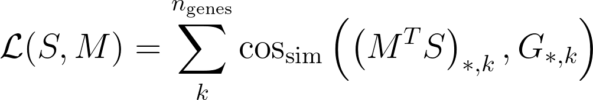

Tangram is a Python package, written in [PyTorch](https://pytorch.org/) and based on [scanpy](https://scanpy.readthedocs.io/en/stable/), for mapping single-cell (or single-nucleus) gene expression data onto spatial gene expression data. The single-cell dataset and the spatial dataset should be collected from the same anatomical region/tissue type, ideally from a biological replicate, and need to share a set of genes. Tangram aligns the single-cell data in space by fitting gene expression on the shared genes. The best way to familiarize yourself with Tangram is to check out [our tutorial](example/1_tutorial_tangram.ipynb).


Tangram has been tested on various types of transcriptomic data (10Xv3, Smart-seq2 and SHARE-seq for single cell data; MERFISH, Visium, Slide-seq, smFISH and STARmap as spatial data). In our [preprint](https://www.biorxiv.org/content/10.1101/2020.08.29.272831v1), we used Tangram to reveal spatial maps of cell types and gene expression at single cell resolution in the adult mouse brain. More recently, we have applied our method to different tissue types including human lung, human kidney developmental mouse brain and metastatic breast cancer.

***
## How to run Tangram

To install Tangram, make sure you have [PyTorch](https://pytorch.org/) and [scanpy](https://scanpy.readthedocs.io/en/stable/) installed. If you need more details on the dependences, look at the `environment.yml` file. Then clone this repo, and import as follows:

```
    import sys
    sys.path.append("/home/tbiancal/git/Tangram") 
    import tangram as tg
```

where `/home/tbiancal/git/Tangram` is substituted with your path pointing to the Tangram repo. The load your spatial data and your single cell data (which should be in [AnnData](https://anndata.readthedocs.io/en/latest/anndata.AnnData.html) format), and pre-process them using `tg.pp_adatas`:

```
    ad_sp = sc.read_h5ad(path)
    ad_sc = sc.read_h5ad(path)
    ad_sc, ad_sp = tg.pp_adatas(ad_sc, ad_sp, genes=None)
```

The function `pp_adatas` simply ensures that each column of the two datasets points to the same gene (and reorder the matrices if it doesn't). Also, it subsets the datasets to a set of training genes passed by `genes`. If `genes=None`, Tangram maps using all genes shared by the two datasets. Once the datasets are pre-processed we can map:

```
    ad_map = tg.map_cells_to_space(ad_sc, ad_sp)
```

The returned AnnData,`ad_map`, is a cell-by-voxel structure where `ad_map.X[i, j]` gives the probability for cell $i$ to be in voxel $j$. This structure can be used to project gene expression from the single cell data to space, which is achieved via `tg.project_genes`.

```
    ad_ge = tg.project_genes(ad_map, ad_sc)
```

The returned `ad_ge` is a voxel-by-gene AnnData, similar to spatial data `ad_sp`, but where gene expression has been projected from the single cells. This allows to extend gene throughput, or correct for dropouts, if the single cells have higher quality (or more genes) than single cell data. It can also be used to transfer cell types onto space. 

For more details on how to use Tangram check out [our tutorial](example/1_tutorial_tangram.ipynb).

***
## How Tangram works under the hood
Tangram instantiates a `Mapper` object passing the following arguments:
- _S_: single cell matrix with shape cell-by-gene. Note that genes is the number of training genes.
- _G_: spatial data matrix with shape voxels-by-genes. Voxel can contain multiple cells.

Then, Tangram searches for a mapping matrix _M_, with shape voxels-by-cells, where the element _M\_ij_ signifies the probability of cell _i_ of being in spot _j_. Tangram computes the matrix _M_ by minimizing the following loss:



where cos_sim is the cosine similarity. The meaning of the loss function is that gene expression of the mapped single cells should be as similar as possible to the spatial data _G_, under the cosine similarity sense.

The above accounts for basic Tangram usage. In our manuscript, we modified the loss function in several ways so as to add various kinds of prior knowledge, such as number of cell contained in each voxels.

***
## Frequently Asked Questions

#### Do I need a GPU for running Tangram?
A GPU is not required but is recommended. We run most of our mappings on a single P100 which maps ~50k cells in a few minutes. 

#### How do I choose a list of training genes?
A good way to start is to use the top 1k unique marker genes, stratified across cell types, as training genes. Alternatively, you can map using the whole transcriptome. Ideally, training genes should contain high quality signals: if most training genes are rich in dropouts or obtained with bad RNA probes your mapping will not be accurate.

#### Do I need cell segmentation for mapping on Visium data?
You do not need to segment cells in your histology for mapping on spatial transcriptomics data (including Visium and Slide-seq). You need, however, cell segmentation if you wish to deconvolve the data (_ie_ deterministically assign a single cell profile to each cell within a spatial voxel).

#### I run out of memory when I map: what should I do?
Reduce your spatial data in various parts and map each single part. If that is not sufficient, you will need to downsample your single cell data as well.

***
## How to cite Tangram
Tangram has been released in the following publication

Biancalani* T., Scalia* G. et al. - _Deep learning and alignment of spatially-resolved whole transcriptomes of single cells in the mouse brain with Tangram_ [biorXiv 10.1101/2020.08.29.272831](https://www.biorxiv.org/content/10.1101/2020.08.29.272831v3) (2020)

If you have questions, please contact the authors of the method:
- Tommaso Biancalani - <tbiancal@broadinstitute.org>  
- Gabriele Scalia - <gscalia@broadinstitute.org>

The artwork has been curated by:
- Anna Hupalowska <ahupalow@broadinstitute.org>


