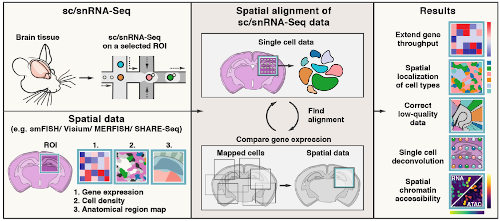

# Tangram

Tangram is a Python package, written in [PyTorch](https://pytorch.org/), for mapping single-cell (or single-nucleus) gene expression data onto spatial gene expression data.  The single-cell dataset and the spatial dataset should be collected from the same anatomical region/tissue type, ideally from a biological replicate, and need to share a set of genes (usually from twenty to a thousand). Tangram aligns the single-cell data in space by fitting gene expression on those genes. 

We mostly work with transcriptomic data (typically 10Xv3 for scRNAseq data; MERFISH or Visium as spatial data). We used Tangram to reveal spatial maps of cell types and gene expression at single cell resolution in adult mouse brain. For more details, check out our [preprint](https://www.biorxiv.org/content/10.1101/2020.08.29.272831v1).

The simplest way to run the method is to install the dependencies, listed in `environment.yml`, and run the two notebooks located in the `example` folder. The two notebooks contain a working pipeline for a targeted in-situ dataset (smFISH) and spatial transcriptomics (Visium). These pipeline should work for most of the cases, but see next section if you need to adapt Tangram to non-plug-and-play situations.

### How to run the tutorial notebooks
- We tested Tangram on `python 3.8`, `pytorch 1.4` and `scanpy 1.6`. All dependencies are listed in `environment.yml`.
- The data used in the tutorial notebooks are found at the [SpaceJam GitHub](https://github.com/spacetx-spacejam/data) (although you would just need the preprocessed versions we linked below).
- Download the annotated [snRNAseq data](https://storage.googleapis.com/tommaso-brain-data/tangram_demo/visp_sn_tpm_small_0430.h5ad) to the `example/data` folder.
- The preprocessed smFISH dataset is available in the `example/data` folder.
- Download the [Visium dataset](https://storage.googleapis.com/tommaso-brain-data/tangram_demo/Allen-Visium_Allen1_cell_count.h5ad), and our [segmentation results](https://storage.googleapis.com/tommaso-brain-data/tangram_demo/Allen-Visium_Allen1_cell_centroids.pkl), to the `example/data` folder.
- The two tutorial notebooks are located in the `example` folder.

***
## Usage guide

Tangram mapper can be instantiated as a class. Two different classes are used to do mapping without and with constraint (i.e., learned filter), respectively:
- `mapping.mapping_optimizer.Mapper` 
- `mapping.mapping_optimizer.MapperConstrained`

### Initialization

A `Mapper` instance is initialized with the following arguments:
- S (`ndarray`): Single nuclei matrix, shape = (number_cell, number_genes).
- G (`ndarray`): Spatial data matrix, shape = (number_spots, number_genes). Spots can be single cells or they can contain multiple cells.
- d (`ndarray`): Spatial density of cells, shape = (number_spots,). This array should satisfy the constraints d.sum() == 1.
- Optional hyperparameters to weight the different terms in the loss function and to enable the weight regularizer.
- The device (`str` or `torch.device`).

In addition to the arguments passed to `Mapper`, a `MapperConstrained` is initialized with:
- The number of cells to be filtered.
- Optional hyperparameters to weight the different terms related to the learned filter in the loss function.

Please refer to the documentation in `mapping_optimizer.py` for details about initialization for the two mapping classes.

### Training

A `Mapper` or  `MapperConstrained` is optimized with the `train` method. The method takes as arguments:
- num_epochs (`int`): Number of epochs.
- learning_rate (`float`): Optional. Learning rate for the optimizer. Default is 0.1.
- print_each (`int`): Optional. Prints the loss each print_each epochs. If None, the loss is never printed. Default is 100.
And returns the optimized data structures.

For an unconstrained `Mapper`, the `train` method returns the optimized mapping matrix with shape = (number_cells, number_spots). For a `MapperConstrained`, also the optimized filter with shape = (number_cells,) is returned. 

### Transfer annotations

Giving the output of the mapping, we can transfer any annotation onto space. 

For uncontrained mapping, the `mapping.utils.transfer_annotations_prob(mapping_matrix, to_transfer)` function can be used. `mapping_matrix` with shape = (number_cells, number_spots) is the optimized mapping, `to_transfer` with shape = (number_cells, number_annotations) is the annotation matrix. 

For contrained mapping, the `mapping.utils.transfer_annotations_prob_filter(mapping_matrix, filter, to_transfer)` function can be used. In this case, the learned filter with shape = (number_cells,) is also passed. 

## Examples

Example Jupyter notebooks are available in the `example` subfolder. Currently, two examples are available:
- smFISH: contrained mapping, prediction cell type probabilities in space, deterministic assigmment of cell types.
- Visium: constrained mapping, prediction cell type probabilities in space, deconvolution.

The notebooks include detailed instructions and expected outputs. Optimization takes few minutes using a single P100 GPU.

## Contact us
If you have questions, you can contact Tommaso Biancalani <tbiancal@broadinstitute.org> and Gabriele Scalia <gscalia@broadinstitute.org>
