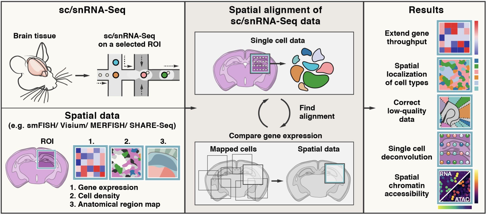

.. Tangram documentation master file, created by
   sphinx-quickstart on Thu Jun 24 20:01:04 2021.
   You can adapt this file completely to your liking, but it should at least
   contain the root `toctree` directive.

|Stars| |PyPI| |PyPI_downloads|

.. |Stars| image:: https://img.shields.io/github/stars/broadinstitute/Tangram?logo=GitHub&color=yellow
   :target: https://github.com/broadinstitute/Tangram/stargazers
.. |PyPI| image:: https://img.shields.io/pypi/v/tangram-sc?logo=PyPI
   :target: https://pypi.org/project/tangram-sc/
.. |PyPI_downloads| image:: https://static.pepy.tech/badge/tangram-sc
   :target: https://pepy.tech/project/tangram-sc
   
.. include:: _contributors.rst

TANGRAM 
==========================
Tangram is a Python package, written in `PyTorch <https://pytorch.org/>`_ and based on `scanpy <https://scanpy.readthedocs.io/en/stable/>`_ , for mapping single-cell (or single-nucleus) gene expression data onto spatial gene expression data. The single-cell dataset and the spatial dataset should be collected from the same anatomical region/tissue type, ideally from a biological replicate, and need to share a set of genes. Tangram aligns the single-cell data in space by fitting gene expression on the shared genes. The best way to familiarize yourself with Tangram is to check out our :ref:`tutorials<tutorials>`. 

    
Tangram News
============================
.. include:: news.rst
   :start-line: 2

Citing Tangram
=============================
.. include:: cite.rst
   :start-line: 2
   
Release Notes
==============================
.. include:: release_notes.rst
   :start-line: 2
   

.. toctree::
   :maxdepth: 2
   :hidden:
   :caption: General
   
   getting_started
   working 
   classes
   questions 
   tutorials
   